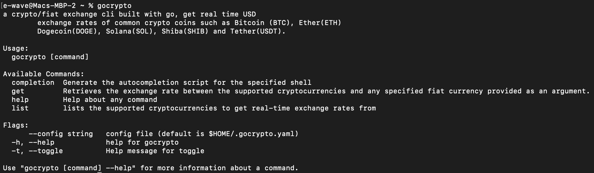
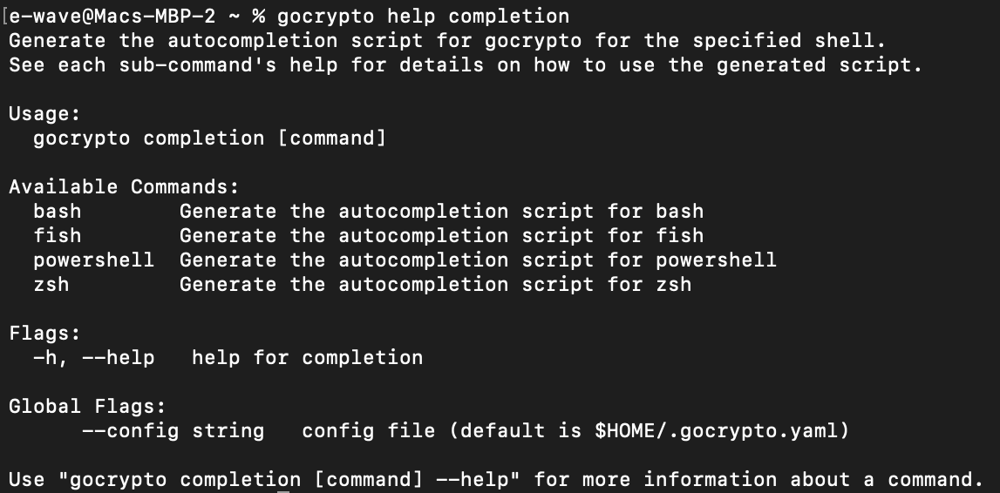
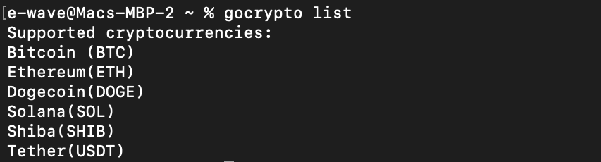
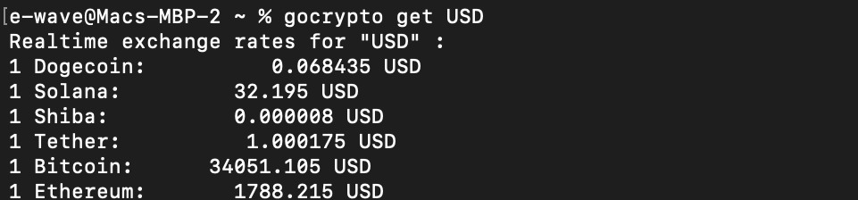

# gocrypto
a crypto/fiat exchange cli built with go


## Table of content

- [Getting Started](#getting-started)
- [Usage](#usage)
- [Available Commands exposed by the CLI](#available-commands-exposed-by-the-cli)
- [Want to contribute?](#want-to-contribute)

## Getting Started
To get started, install [Go](https://go.dev) if you haven't already, then run the following command to install the CLI.

```bash
go install github.com/E-wave112/gocrypto/cmd/gocrypto@latest
```

## Usage

```bash
gocrypto [command]
```
A pictorial representation of just running the `gocrypto` command without any arguments.



For help on any command, run `gocrypto [command] --help` or `gocrypto help [command]`



## Available Commands exposed by the CLI

### 1. gocrypto list

lists the supported cryptocurrencies to get real-time exchange rates from.



### 2. gocrypto get [currency]

Retrieves the exchange rate between the supported cryptocurrencies and any specified fiat currency provided as an argument. defaults to `USD` if no currency argument is provided.



Other commands are `gocrypto help` and `gocrypto completion [command]` for Generating the autocompletion script for the specified shell be it `bash`, `zsh`, `fish`, or `powershell`.


## Want to contribute?

Contributions are welcome! Kindly refer to the [contribution guidelines](https://github.com/E-wave112/gocrypto/CONTRIBUTING.md)